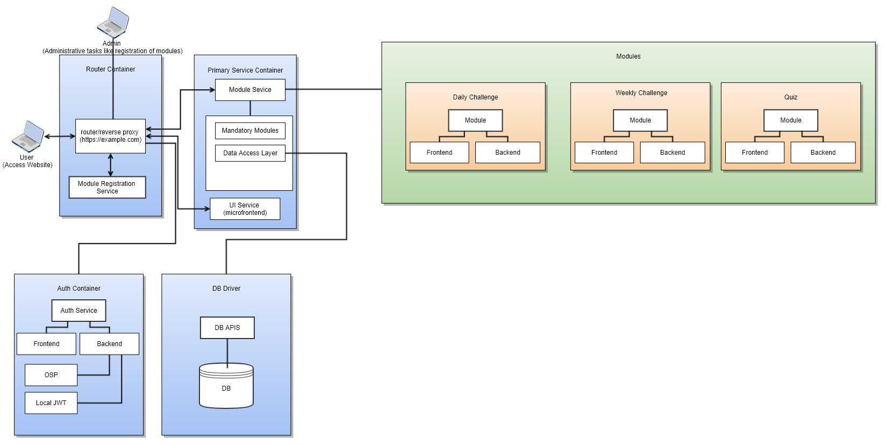
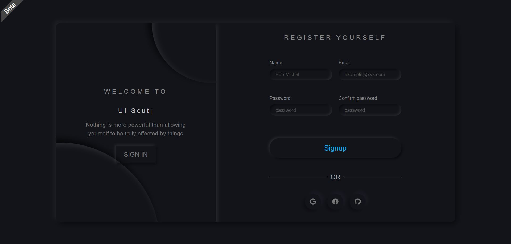
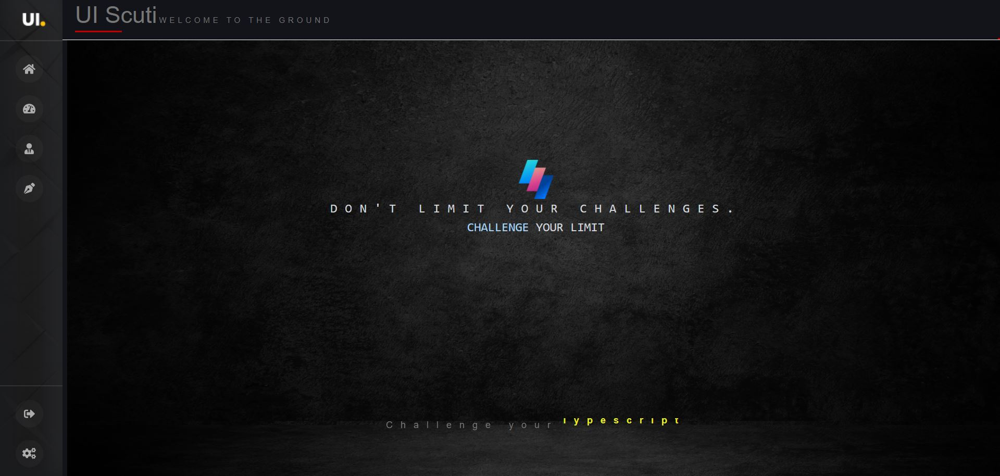
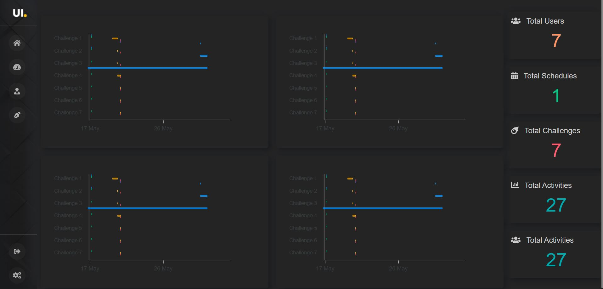
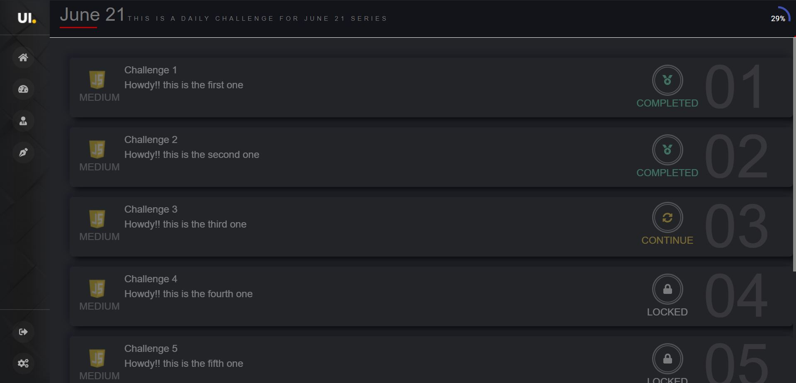

<h1 align="center">
  <br>
  </a>
  <br>
  The Challenger
  <br>
</h1>

<h4 align="center">Don't limit your challenges, Challenge your limits.</h4>


<p align="center">
  <a href="#key-features">Key Features</a> •
  <a href="#design">Design</a> •
  <a href="#quick-start">Quick Start</a> •

</p>

## Key Features

* Multiple account provider - Register/ log in with Google or Facebook or GIT or local db.
* Build your challenge: Build you own challenge
  - Daily challenge.
  - Schedule challenge
  - Quiz
  - etc
* Role based: A granular set of roles for access various areas of the application
* Monitor: A rich dashboard fro monitoring all activities
* GitHub Flavored Markdown  

## Design

This is an application based on plug-and-play architecture. All services are being developed as modules. As on when a module is ready to be deployed, it can just be be plugged using couple of clicks
<div align="center">

</div>

## Quick Start

To clone and run this application, you'll need [MongoDB](https://www.mongodb.com), [Git](https://git-scm.com) and [Node.js](https://nodejs.org/en/download/) (which comes with [npm](http://npmjs.com)) installed on your computer. From your command line:


#### code-tester-framework

```bash
# Clone code-tester-framework repository
$ git clone https://github.com/The-Challenger/code-tester-framework.git

# Go into the repository
$ cd code-tester-framework

# Install dependencies
$ npm install

# Run the app
$ npm start
```

#### front-end-service

```bash
# Clone front-end-service repository
$ git clone https://github.com/The-Challenger/front-end-service.git

# Go into the repository
$ cd front-end-service

# Install dependencies
$ npm install

# Run the app
$ npm start
```


#### module-service-provider

```bash
# Clone module-service-provider repository
$ git clone https://github.com/The-Challenger/module-service-provider.git

# Go into the repository
$ cd module-service-provider

# Install dependencies
$ npm install

# Run the app
$ npm start
```

#### user-management

```bash
# Clone user-management repository
$ git clone https://github.com/The-Challenger/user-management.git

# Go into the repository
$ cd user-management

# Install dependencies
$ npm install

# Run the app
$ npm start
```


#### node-proxy-service

```bash
# Clone node-proxy-service repository
$ git clone https://github.com/The-Challenger/node-proxy-service.git

# Go into the repository
$ cd node-proxy-service

# Install dependencies
$ npm install

# Run the app
$ npm start
```

### Run the application
Hit 
```
http://localhost:8050
```


Note: If you're using Linux Bash for Windows, [see this guide](https://www.howtogeek.com/261575/how-to-run-graphical-linux-desktop-applications-from-windows-10s-bash-shell/) or use `node` from the command prompt.


## Screenshots






## License

MIT

---
